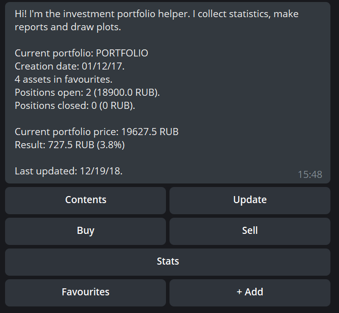

# НИС Науки о данных 2018/2019. Мини-проект по разработке чат-бота.

## “Бот для мониторинга портфеля ценных бумаг”

Функциональные возможности:

- поиск ценных бумаг и фондов из онлайн-каталога и выгрузка котировок
- транзакции типа "покупка", "продажа" по определенной цене и в определенную дату
- формирование статистики по портфелю и по отдельным ценным бумагам

Описание сделанной работы:

1. Разработан модуль для выгрузки котировок с сайта  investfunds.ru (только для фондов)

2. Разработана система классов, которые предоставляют api для работы с портфелем ценных бумаг как с black box’ом

3. С помощью библиотеки `python-telegram-bot` разработан интерфейс для взаимодействия с системой через Telegram-бота 

4. Реализован интерфейс смешанного типа - есть и кнопочные меню, и hard-coded диалоги с автоматическим распознаванием дат и чисел.

В настоящий момент структура диалога следующая:

- При первом запуске пользователю предлагается в диалоговой форме указать название для его портфеля ценных бумаг и дату его создания (начиная с этой даты будут грузиться котировки).

- При последующих запусках пользователя будет встречать главное меню:

Из главного меню доступны следующие команды:

- просмотреть содержимое портфеля (contents)
- переключить автоматическую периодическую загрузку котировок (update)
- добавить транзакции покупки/продажи: функция реализована в виде диалога со следующими шагами:
  - выбор ЦБ из избранного
  - ввод даты транзакции
  - ввод объема транзакции
  - ввод цены за единицу (при этом в качестве справки выводится цена бумаги в этот день из базы данных)
  - подтверждение правильности транзакции
- просмотреть статистику (stats) - в настоящий момент доступна только понедельная статистика
  - по каждой из бумаг из избранного
  - по портфелю в целом
- просмотреть список ценных бумаг в избранном 
  - посмотреть на график котировок 
  - удалить из избранного
- добавить ценную бумагу в избранное
  - пользователю предлагается ввести поисковой запрос и выбрать подходящий вариант из списка